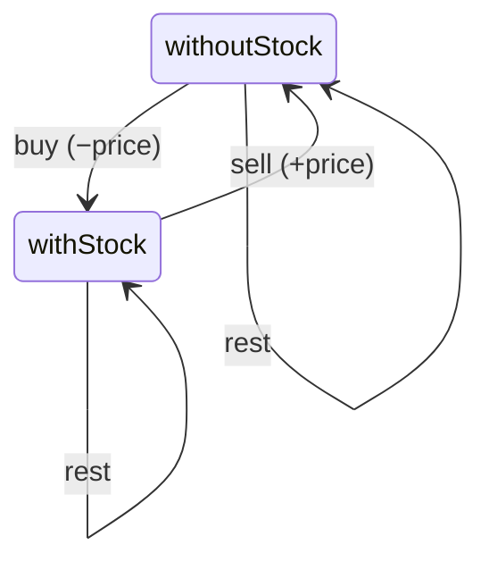
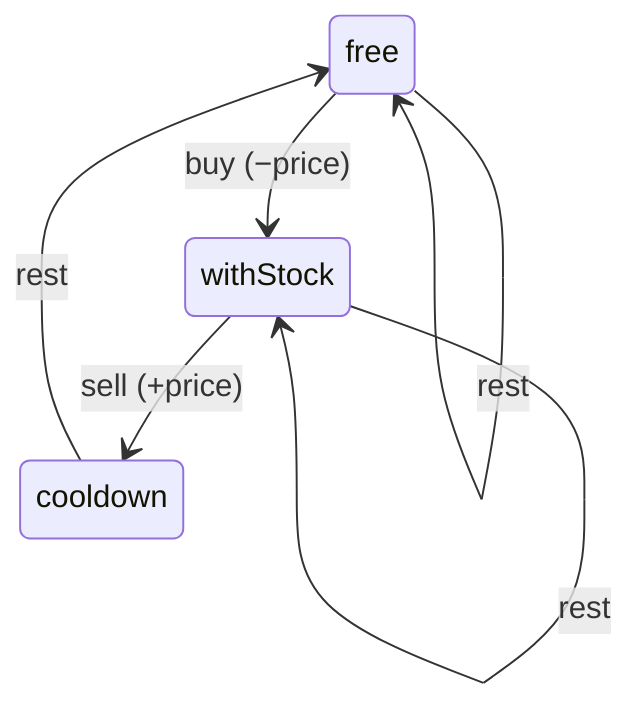

# DP Interview Notes

## Index

| # | Part | Problems |
|---|---|---|
| 1 | [Linear DP](#part-1--linear-dp)   | [Climbing Stairs #70](https://leetcode.com/problems/climbing-stairs/) · [House Robber #198](https://leetcode.com/problems/house-robber/) · [House Robber II #213](https://leetcode.com/problems/house-robber-ii/) · [Min Cost Climbing Stairs #746](https://leetcode.com/problems/min-cost-climbing-stairs/) |
| 2 | [Knapsack](#part-2--knapsack) | [Partition Equal Subset Sum #416](https://leetcode.com/problems/partition-equal-subset-sum/) · [Coin Change #322](https://leetcode.com/problems/coin-change/) · [Coin Change II #518](https://leetcode.com/problems/coin-change-ii/) |
| 3 | [Subsequence DP](#part-3--subsequence-dp) | [LIS #300](https://leetcode.com/problems/longest-increasing-subsequence/) · [LCS #1143](https://leetcode.com/problems/longest-common-subsequence/) · [Edit Distance #72](https://leetcode.com/problems/edit-distance/) |
| 4 | [Grid DP](#part-4--grid-dp) | [Unique Paths #62](https://leetcode.com/problems/unique-paths/) · [Min Path Sum #64](https://leetcode.com/problems/minimum-path-sum/) · [Maximal Square #221](https://leetcode.com/problems/maximal-square/) |
| 5 | [Interval DP](#part-5--interval-dp) | [Palindrome Partitioning II #132](https://leetcode.com/problems/palindrome-partitioning-ii/) ✅ · [Burst Balloons #312](https://leetcode.com/problems/burst-balloons/) ⚠️ · Matrix Chain ⚠️ |
| 6 | [State Machine](#part-6--state-machine-dp) | [Stock II #122](https://leetcode.com/problems/best-time-to-buy-and-sell-stock-ii/) ✅ · [Stock III #123](https://leetcode.com/problems/best-time-to-buy-and-sell-stock-iii/) ⚠️ · [Stock Cooldown #309](https://leetcode.com/problems/best-time-to-buy-and-sell-stock-with-cooldown/) ⚠️ |

---

## General — Pattern Identification

### How to Identify the Pattern

**Step 1: What are you iterating over?**

| Input type | Likely pattern |
|---|---|
| Single array/string | Linear DP or Subsequence |
| Two arrays/strings | Subsequence (LCS-style) |
| 2D grid | Grid DP |
| Single array, pick subarrays/intervals | Interval DP |
| Items with weight/value + capacity | Knapsack |
| States with transitions (buy/sell/hold) | State machine |

**Step 2: What's the choice at each step?**
- Include or exclude this element → Knapsack / Subsequence
- How many ways to reach here → Linear DP
- Best value from a range `[i..j]` → Interval DP
- Move in a direction (up/down/left/right) → Grid DP
- Switch between modes (hold, sold, cooldown) → State machine

**Step 3: Keyword triggers**

| Keyword | Think |
|---|---|
| "subsequence", "subset" | Subsequence or Knapsack |
| "substring", "subarray" | Linear DP or Interval |
| "path", "grid", "robot" | Grid DP |
| "partition", "split into k parts" | Interval or Knapsack |
| "at most k transactions", "cooldown" | State machine |
| "palindrome" | Interval DP |
| "coin change", "combinations" | Unbounded Knapsack |

### Core Questions to Ask on Any DP Problem
1. What is the **state** — what information do I need at each step?
2. What is the **choice** at each state?
3. What are the **base cases**?
4. Top-down or bottom-up?

### DP vs Backtracking

| Output type | Approach |
|---|---|
| Single integer (min/max/count) | DP |
| All solutions / enumerate every X | Backtracking |
| Is it possible? | BFS or DP |

**Signal question:** "Are the same subproblems being recomputed?"
- Yes → DP (memoize the overlap)
- No → Backtracking (every path is unique)

### Key Distinctions

**Interval DP vs Linear DP**
- **Interval DP:** `dp[i][j]` depends on `dp[i][k]` and `dp[k+1][j]` for some split point `k`. Optimizing over a range.
- **Linear DP:** `dp[i]` depends on previous `dp[j]` where `j < i`. Scanning forward.

**0/1 Knapsack vs Unbounded Knapsack**
- **0/1:** Each item used at most once
- **Unbounded:** Items can be reused

**Knapsack Loop Order Rules**

| Problem type | Outer loop | Inner loop | Direction |
|---|---|---|---|
| 0/1 Knapsack | items | capacity | **backwards** |
| Unbounded — min/max | amount | coins | **forwards** |
| Unbounded — count combinations | coins | amount | **forwards** |

**Why backwards for 0/1?** Prevents reusing the same item in the same pass.
**Why outer-on-coins for combinations?** Prevents `[1,2]` and `[2,1]` being counted as different.

---

## Part 1 — Linear DP

#### 1.1 Pattern & Identification
- `dp[i]` depends on a few previous states (`dp[i-1]`, `dp[i-2]`)
- Single array, scanning left to right
- Usually optimizable to O(1) space using two variables

#### 1.2 Problems

### 1.2.1 Climbing Stairs #70

📌 **Problem:** `n` steps, can climb 1 or 2 at a time. Count distinct ways.

🔑 **State:** `dp[i]` = number of distinct ways to reach step `i`

⚡ **Recurrence:** `dp[i] = dp[i-1] + dp[i-2]`

🧱 **Base cases:** `dp[0] = 1`, `dp[1] = 1` — this is just Fibonacci.

```java
public int climbStairs(int n) {
    if (n <= 1) return 1;
    int prevsPrev = 1, prev = 1, res = 0;
    for (int i = 2; i <= n; i++) {
        res = prevsPrev + prev;
        prevsPrev = prev;
        prev = res;
    }
    return res;
}
```

⚙️ **Space:** O(1)

**Follow-up:** Steps can be any set `{1,2,3}` → Unbounded Knapsack (#377). `dp[i] += dp[i - step]` for each step.

---

### 1.2.2 House Robber #198

📌 **Problem:** Rob houses in a line, can't rob adjacent. Maximize money.

🔑 **State:** `dp[i]` = max money from houses `0` to `i`

⚡ **Recurrence:** `dp[i] = max(nums[i] + dp[i-2], dp[i-1])`

🧱 **Base cases:** `dp[0] = nums[0]`, `dp[1] = max(nums[0], nums[1])`

```java
public int rob(int[] nums) {
    if (nums.length == 1) return nums[0];
    int prevsPrev = nums[0];
    int prev = Math.max(nums[0], nums[1]);
    int res = prev;
    for (int i = 2; i < nums.length; i++) {
        res = Math.max(nums[i] + prevsPrev, prev);
        prevsPrev = prev;
        prev = res;
    }
    return res;
}
```

⚙️ **Space:** O(1)

---

### 1.2.3 House Robber II #213

Houses in a circle — run robber twice: `nums[0..n-2]` and `nums[1..n-1]`. Return max of both. Handle edge case: `nums.length == 2` separately.

---

### 1.2.4 Min Cost Climbing Stairs #746

📌 **Problem:** Each step has a cost. Pay cost to jump 1 or 2 steps. Find min cost to reach the top.

> [!TIP]
> The top is **beyond** the last step — position `n`. `dp` array needs size `n+1`.

🔑 **State:** `dp[i]` = min cost to **reach** position `i`

⚡ **Recurrence:** `dp[i] = min(cost[i-1] + dp[i-1], cost[i-2] + dp[i-2])`

🧱 **Base cases:** `dp[0] = 0`, `dp[1] = 0` (both starting positions are free)

```java
// Bottom-up
public int minCostClimbingStairs(int[] cost) {
    int n = cost.length;
    int[] dp = new int[n + 1];
    for (int i = 2; i <= n; i++)
        dp[i] = Math.min(cost[i-1] + dp[i-1], cost[i-2] + dp[i-2]);
    return dp[n];
}

// Top-down
public int minCostClimbingStairs(int[] cost) {
    int n = cost.length;
    memo = new int[n + 1];
    Arrays.fill(memo, -1);
    return solve(cost, n);
}
private int solve(int[] cost, int i) {
    if (i <= 1) return 0;
    if (memo[i] != -1) return memo[i];
    return memo[i] = Math.min(cost[i-1] + solve(cost, i-1), cost[i-2] + solve(cost, i-2));
}
```

> [!WARNING]
> Returning `dp[n-1]` instead of `dp[n]` — the top is at index `n`.

---

## Part 2 — Knapsack

#### 2.1 Pattern & Identification
- At each item, binary choice: take or skip (0/1), or take multiple times (unbounded)
- 3 questions: What are the **items**? What is the **capacity**? Can I **reuse** items?

#### 2.2 Problems

### 2.2.1 Partition Equal Subset Sum #416

📌 **Problem:** Can you split array into two subsets with equal sum?

> [!TIP]
> If sum is odd → false. Otherwise find any subset summing to `sum/2` → 0/1 Knapsack.

🔑 **State:** `dp[i]` = can we form sum `i`? (boolean)

⚡ **Recurrence:** `dp[i] = dp[i] || dp[i - num]`

🧱 **Base case:** `dp[0] = true`

```java
// Bottom-up
public boolean canPartition(int[] nums) {
    int sum = 0;
    for (int num : nums) sum += num;
    if (sum % 2 != 0) return false;
    int target = sum / 2;
    boolean[] dp = new boolean[target + 1];
    dp[0] = true;
    for (int num : nums)
        for (int i = target; i >= num; i--)  // backwards — 0/1
            dp[i] = dp[i] || dp[i - num];
    return dp[target];
}

// Top-down
private boolean isSubSetSum(int[] nums, int target, int index, HashMap<String, Boolean> memo) {
    if (target == 0) return true;
    if (index >= nums.length || target < 0) return false;
    String key = target + "---" + index;
    if (memo.containsKey(key)) return memo.get(key);
    boolean result = isSubSetSum(nums, target - nums[index], index + 1, memo)
                  || isSubSetSum(nums, target, index + 1, memo);
    memo.put(key, result);
    return result;
}
```

⚙️ **Complexity:** Time `O(n × target)`, Space `O(target)`

---

### 2.2.2 Coin Change #322

📌 **Problem:** Minimum coins to make amount. Coins reusable → Unbounded Knapsack (minimize).

🔑 **State:** `dp[i]` = min coins to make amount `i`

⚡ **Recurrence:** `dp[i] = min(dp[i], 1 + dp[i - coin])` for each coin

🧱 **Base case:** `dp[0] = 0`, rest = `Integer.MAX_VALUE`

> [!NOTE]
> Only update if `dp[i - coin] != MAX_VALUE` — avoids integer overflow.

```java
// Bottom-up
public int coinChange(int[] coins, int amount) {
    int[] dp = new int[amount + 1];
    Arrays.fill(dp, Integer.MAX_VALUE);
    dp[0] = 0;
    for (int i = 1; i <= amount; i++)
        for (int coin : coins)
            if (coin <= i && dp[i - coin] != Integer.MAX_VALUE)
                dp[i] = Math.min(dp[i], 1 + dp[i - coin]);
    return dp[amount] == Integer.MAX_VALUE ? -1 : dp[amount];
}

// Top-down
private int coinChange(int[] coins, int amount, Map<Integer, Integer> memo) {
    if (amount == 0) return 0;
    if (amount < 0) return -1;
    if (memo.containsKey(amount)) return memo.get(amount);
    int minCoins = Integer.MAX_VALUE;
    for (int coin : coins) {
        int res = coinChange(coins, amount - coin, memo);
        if (res != -1) minCoins = Math.min(minCoins, 1 + res);
    }
    minCoins = (minCoins == Integer.MAX_VALUE) ? -1 : minCoins;
    memo.put(amount, minCoins);
    return minCoins;
}
```

⚙️ **Complexity:** Time `O(amount × coins.length)`, Space `O(amount)`

---

### 2.2.3 Coin Change II #518

📌 **Problem:** Count combinations to make amount. Coins reusable → Unbounded Knapsack (count combinations).

🔑 **State:** `dp[i]` = number of combinations to make amount `i`

⚡ **Recurrence:** `dp[i] += dp[i - coin]` for each coin

🧱 **Base case:** `dp[0] = 1`

> [!IMPORTANT]
> Outer loop on **coins**, inner on **amount** — prevents counting `[1,2]` and `[2,1]` as different combinations.

```java
// Bottom-up
public int change(int amount, int[] coins) {
    int[] dp = new int[amount + 1];
    dp[0] = 1;
    for (int coin : coins)               // outer on coins
        for (int i = 1; i <= amount; i++) // inner on amount
            if (coin <= i)
                dp[i] += dp[i - coin];
    return dp[amount];
}

// Top-down
private int change(int amount, int[] coins, int coinIndex, Map<String, Integer> memo) {
    String key = amount + "--" + coinIndex;
    if (memo.containsKey(key)) return memo.get(key);
    if (amount == 0) return 1;
    if (coinIndex >= coins.length) return 0;
    int totalWays = 0;
    for (int qty = 0; qty * coins[coinIndex] <= amount; qty++)
        totalWays += change(amount - qty * coins[coinIndex], coins, coinIndex + 1, memo);
    memo.put(key, totalWays);
    return totalWays;
}
```

⚙️ **Complexity:** Time `O(amount × coins.length)`, Space `O(amount)`

---

## Part 3 — Subsequence DP

#### 3.1 Pattern & Identification
- Single sequence: `dp[i]` = answer ending at index `i`
- Two sequences: `dp[i][j]` = answer using first `i` chars of s1 and first `j` chars of s2
- Always ask: include/skip, match/mismatch

#### 3.2 Problems

### 3.2.1 Longest Increasing Subsequence #300

📌 **Problem:** Length of longest strictly increasing subsequence.

🔑 **State:** `dp[i]` = LIS ending at index `i` (element at `i` always included)

⚡ **Recurrence:** `dp[i] = 1 + max(dp[j])` for all `j < i` where `nums[j] < nums[i]`

🎯 **Answer:** `max(dp[i])` across all `i` — LIS can end anywhere

🧱 **Base case:** `dp[i] = 1`

```java
// Bottom-up O(n²)
public int lengthOfLIS(int[] nums) {
    int[] dp = new int[nums.length];
    Arrays.fill(dp, 1);
    int max = 1;
    for (int i = 1; i < nums.length; i++) {
        for (int j = 0; j < i; j++)
            if (nums[j] < nums[i])
                dp[i] = Math.max(dp[i], 1 + dp[j]);
        max = Math.max(max, dp[i]);
    }
    return max;
}

// O(n log n) — tails array + binary search
public int lengthOfLIS(int[] nums) {
    int[] tails = new int[nums.length];
    int size = 0;
    for (int num : nums) {
        int lo = 0, hi = size;
        while (lo < hi) {
            int mid = lo + (hi - lo) / 2;
            if (tails[mid] < num) lo = mid + 1;
            else hi = mid;
        }
        tails[lo] = num;
        if (lo == size) size++;
    }
    return size;
}
```

> [!TIP]
> `tails[i]` = smallest tail of any increasing subsequence of length `i+1`. Always sorted → binary search. `tails` is NOT the actual LIS. `size` = answer.

---

### 3.2.2 Longest Common Subsequence #1143

📌 **Problem:** Length of longest common subsequence of two strings.

💡 **Intuition:**
- Match → include both, move both pointers forward
- No match → skip one, take the best result

🔑 **State:** `dp[i][j]` = LCS of `text1[0..i-1]` and `text2[0..j-1]`

⚡ **Recurrence:**
```
match:    dp[i][j] = 1 + dp[i-1][j-1]
no match: dp[i][j] = max(dp[i-1][j], dp[i][j-1])
```

**Example:** `text1="abcde"`, `text2="ace"` → answer = 3
```
      ""  a   c   e
  ""   0   0   0   0
  a    0   1   1   1
  b    0   1   1   1
  c    0   1   2   2
  d    0   1   2   2
  e    0   1   2   3   ← answer
```

```java
// Bottom-up
public int longestCommonSubsequence(String text1, String text2) {
    int m = text1.length(), n = text2.length();
    int[][] dp = new int[m + 1][n + 1];
    for (int i = 1; i <= m; i++)
        for (int j = 1; j <= n; j++)
            if (text1.charAt(i-1) == text2.charAt(j-1))
                dp[i][j] = 1 + dp[i-1][j-1];
            else
                dp[i][j] = Math.max(dp[i-1][j], dp[i][j-1]);
    return dp[m][n];
}

// Top-down
private int[][] memo;
public int longestCommonSubsequence(String text1, String text2) {
    memo = new int[text1.length()][text2.length()];
    Arrays.stream(memo).forEach(row -> Arrays.fill(row, -1));
    return solve(text1, text2, 0, 0);
}
private int solve(String text1, String text2, int i, int j) {
    if (i >= text1.length() || j >= text2.length()) return 0;
    if (memo[i][j] != -1) return memo[i][j];
    int lcs;
    if (text1.charAt(i) == text2.charAt(j))
        lcs = 1 + solve(text1, text2, i+1, j+1);
    else
        lcs = Math.max(solve(text1, text2, i+1, j), solve(text1, text2, i, j+1));
    return memo[i][j] = lcs;
}
```

> [!WARNING]
> HashMap keys or `toCharArray()` inside loops → TLE. Use 2D int array memo and `charAt()`.

---

### 3.2.3 Edit Distance #72

📌 **Problem:** Minimum operations (insert, delete, replace) to convert `word1` to `word2`.

🔑 **State:** `dp[i][j]` = min operations to convert `word1[0..i-1]` to `word2[0..j-1]`

🧱 **Base cases:** `dp[i][0] = i`, `dp[0][j] = j`

⚡ **Recurrence:**
```
match:    dp[i][j] = dp[i-1][j-1]
no match: dp[i][j] = 1 + min(dp[i-1][j], dp[i][j-1], dp[i-1][j-1])
                              delete      insert       replace
```

**Example:** `word1="horse"`, `word2="ros"` → answer = 3
```
      ""  r   o   s
  ""   0   1   2   3
  h    1   1   2   3
  o    2   2   1   2
  r    3   1   2   2
  s    4   2   2   2
  e    5   3   3   3   ← answer
```

```java
// Bottom-up
public int minDistance(String word1, String word2) {
    int m = word1.length(), n = word2.length();
    int[][] dp = new int[m + 1][n + 1];
    for (int i = 1; i <= m; i++) dp[i][0] = i;
    for (int j = 1; j <= n; j++) dp[0][j] = j;
    for (int i = 1; i <= m; i++)
        for (int j = 1; j <= n; j++)
            if (word1.charAt(i-1) == word2.charAt(j-1))
                dp[i][j] = dp[i-1][j-1];
            else
                dp[i][j] = 1 + Math.min(dp[i-1][j], Math.min(dp[i-1][j-1], dp[i][j-1]));
    return dp[m][n];
}

// Top-down
public int minDistance(String word1, String word2) {
    int[][] memo = new int[word1.length()][word2.length()];
    Arrays.stream(memo).forEach(row -> Arrays.fill(row, -1));
    return solve(word1, word2, 0, 0, memo);
}
private int solve(String word1, String word2, int i, int j, int[][] memo) {
    if (i == word1.length()) return word2.length() - j;  // insert remaining
    if (j == word2.length()) return word1.length() - i;  // delete remaining
    if (memo[i][j] != -1) return memo[i][j];
    int result;
    if (word1.charAt(i) == word2.charAt(j))
        result = solve(word1, word2, i+1, j+1, memo);
    else
        result = 1 + Math.min(
            solve(word1, word2, i+1, j+1, memo),
            Math.min(solve(word1, word2, i+1, j, memo), solve(word1, word2, i, j+1, memo))
        );
    return memo[i][j] = result;
}
```

> [!WARNING]
> Return `word2.length() - j`, not `word2.length()` — return REMAINING chars, not total length.

---

## Part 4 — Grid DP

#### 4.1 Pattern & Identification
- Moving through a 2D grid, typically top-left to bottom-right
- `dp[i][j]` = answer at cell `(i, j)`
- Dependencies always **top** and **left**
- Space reducible to O(n) — only need previous row

#### 4.2 Problems

### 4.2.1 Unique Paths #62

📌 **Problem:** Count unique paths top-left to bottom-right. Only right or down moves.

🔑 **State:** `dp[i][j]` = number of unique paths to reach `(i,j)`

⚡ **Recurrence:** `dp[i][j] = dp[i-1][j] + dp[i][j-1]`

🧱 **Base cases:** `dp[0][j] = 1`, `dp[i][0] = 1`

```java
// Top-down
public int uniquePaths(int m, int n) {
    int[][] memo = new int[m][n];
    Arrays.stream(memo).forEach(row -> Arrays.fill(row, -1));
    return solve(m, n, 0, 0, memo);
}
private int solve(int m, int n, int r, int c, int[][] memo) {
    if (r == m-1 && c == n-1) return 1;
    if (r >= m || c >= n) return 0;
    if (memo[r][c] != -1) return memo[r][c];
    return memo[r][c] = solve(m, n, r+1, c, memo) + solve(m, n, r, c+1, memo);
}

// Bottom-up O(n) space
public int uniquePaths(int m, int n) {
    int[] dp = new int[n];
    Arrays.fill(dp, 1);
    for (int i = 1; i < m; i++)
        for (int j = 1; j < n; j++)
            dp[j] = dp[j] + dp[j-1];  // dp[j]=above, dp[j-1]=left
    return dp[n-1];
}
```

---

### 4.2.2 Minimum Path Sum #64

📌 **Problem:** Min sum path top-left to bottom-right. Only right or down moves.

🔑 **State:** `dp[i][j]` = min path sum to reach `(i,j)`

⚡ **Recurrence:** `dp[i][j] = grid[i][j] + min(dp[i-1][j], dp[i][j-1])`

🧱 **Base cases:** Accumulate actual grid costs along first row and col (unlike #62 which uses flat 1s).

```java
// Top-down
public int minPathSum(int[][] grid) {
    int[][] memo = new int[grid.length][grid[0].length];
    Arrays.stream(memo).forEach(row -> Arrays.fill(row, -1));
    return solve(grid, grid.length-1, grid[0].length-1, memo);
}
private int solve(int[][] grid, int r, int c, int[][] memo) {
    if (memo[r][c] != -1) return memo[r][c];
    if (r == 0 && c == 0) return memo[r][c] = grid[0][0];
    if (r == 0) return memo[r][c] = grid[0][c] + solve(grid, 0, c-1, memo);
    if (c == 0) return memo[r][c] = grid[r][0] + solve(grid, r-1, 0, memo);
    return memo[r][c] = grid[r][c] + Math.min(solve(grid, r-1, c, memo), solve(grid, r, c-1, memo));
}

// O(1) space — modify grid in place
public int minPathSum(int[][] grid) {
    int m = grid.length, n = grid[0].length;
    for (int j = 1; j < n; j++) grid[0][j] += grid[0][j-1];
    for (int i = 1; i < m; i++) grid[i][0] += grid[i-1][0];
    for (int i = 1; i < m; i++)
        for (int j = 1; j < n; j++)
            grid[i][j] += Math.min(grid[i-1][j], grid[i][j-1]);
    return grid[m-1][n-1];
}
```

> [!WARNING]
> Mutating input for O(1) space — flag in interview. Say "modifying input grid, acceptable?"

---

### 4.2.3 Maximal Square #221

📌 **Problem:** Largest square of `'1'`s in binary matrix. Return area.

🔑 **State:** `dp[i][j]` = side length of largest square with bottom-right at `(i,j)`

⚡ **Recurrence:**
```
'0': dp[i][j] = 0
'1': dp[i][j] = 1 + min(dp[i-1][j], dp[i][j-1], dp[i-1][j-1])
```

🎯 **Answer:** `max(dp[i][j])²` — track max side, return side² for area.

**Example:**
```
Matrix:        dp:
1  0  1  0     1  0  1  0
1  0  1  1     1  0  1  1
1  1  1  1     1  1  1  2   ← dp[2][3]=1+min(1,1,1)=2
1  0  0  1     1  0  0  1
```

```java
// Bottom-up
public int maximalSquare(char[][] matrix) {
    int m = matrix.length, n = matrix[0].length;
    int[][] dp = new int[m][n];
    int max = 0;
    for (int i = 0; i < m; i++) {
        for (int j = 0; j < n; j++) {
            dp[i][j] = matrix[i][j] - '0';
            if (i > 0 && j > 0 && dp[i][j] == 1)
                dp[i][j] = 1 + Math.min(dp[i-1][j], Math.min(dp[i-1][j-1], dp[i][j-1]));
            max = Math.max(max, dp[i][j]);
        }
    }
    return max * max;
}
```

> [!WARNING]
> `dp` stores **side length**, not area — return `max * max`.
> Answer is `max(dp[i][j])` across ALL cells, not just `dp[m-1][n-1]`.
> `matrix[i][j] - '0'` to convert char to int.

---

## Part 5 — Interval DP

#### 5.1 Pattern & Identification
- `dp[i][j]` depends on splitting range `[i..j]` at some point `k`
- Fill by **increasing length** — short ranges before long ones
- When forward subproblems are entangled, reverse thinking: fix what happens **last**, not first

#### 5.2 Problems

### 5.2.1 Palindrome Partitioning II #132

📌 **Problem:** Minimum cuts to partition string `s` into palindromes.

**Companion:** #131 returns ALL partitions (backtracking). #132 asks for minimum (DP) — single integer output → always DP.

🔑 **State:** `dp[i]` = min cuts for `s[0..i]`

⚡ **Recurrence:**
- `s[0..i]` is palindrome → `dp[i] = 0`
- Otherwise: `dp[i] = min(dp[j-1] + 1)` for all `j` in `[1..i]` where `s[j..i]` is palindrome

**Why `dp[i] = i` initially?** Worst case: `i` cuts (each char its own partition).

> [!TIP]
> O(n²) approach — precompute `isPalin[i][j]` table first.
> Fill `i` from `n-1` down to `0` so that `isPalin[i+1][j-1]` is already computed. Base: `j - i <= 2`.

```java
public int minCut(String s) {
    int n = s.length();
    boolean[][] isPalin = new boolean[n][n];
    for (int i = n - 1; i >= 0; i--)
        for (int j = i; j < n; j++)
            if (s.charAt(i) == s.charAt(j))
                isPalin[i][j] = (j - i <= 2) || isPalin[i+1][j-1];

    int[] dp = new int[n];
    for (int i = 0; i < n; i++) {
        if (isPalin[0][i]) { dp[i] = 0; continue; }
        dp[i] = i;
        for (int j = 1; j <= i; j++)
            if (isPalin[j][i])
                dp[i] = Math.min(dp[i], dp[j-1] + 1);
    }
    return dp[n-1];
}
```

⚙️ **Complexity:** O(n²) time, O(n²) space.

> [!WARNING]
> `isPalindrome` base case `start > end → false` instead of `start >= end → true`.

---

### 5.2.2 Burst Balloons #312 ⚠️ concept only

📌 **Problem:** Burst all balloons to maximize coins. Coins = `left × nums[i] × right` at time of bursting.

> [!TIP]
> Forward DP fails — neighbours change when balloons burst. Fix what happens **last** in range `(i, j)` instead. Its neighbours are always the fixed boundaries `i` and `j`.

⚡ **Recurrence:** `dp[i][j] = max over k: nums[i] × nums[k] × nums[j] + dp[i][k] + dp[k][j]`

**Padding:** Add `1`s at both ends. Fill by increasing range length. O(n³) time, O(n²) space.

---

### 5.2.3 Matrix Chain Multiplication ⚠️ concept only

Same pattern as Burst Balloons. Split point `k` = last multiplication in range. Fill by increasing length. O(n³) time, O(n²) space.

---

## Part 6 — State Machine DP

#### 6.1 Pattern & Identification
- Fixed set of states at each step (holding, not holding, cooldown, etc.)
- Transitions governed by actions (buy, sell, rest)
- Space-optimizable to one variable per state

#### 6.2 Problems

### 6.2.1 Best Time to Buy/Sell Stock II #122

📌 **Problem:** Unlimited transactions, maximize profit.



🔑 **States:**
- `withStock` = best profit currently holding stock
- `withoutStock` = best profit currently not holding stock

⚡ **Recurrence:**
```
newWithStock    = max(withStock, withoutStock − prices[i])  // held OR bought today
newWithoutStock = max(withoutStock, withStock + prices[i])  // stayed out OR sold today
```

🧱 **Base cases:** `withStock = MIN_VALUE`, `withoutStock = 0`

🎯 **Answer:** `withoutStock` at the end

```java
public int maxProfit(int[] prices) {
    int withStock    = Integer.MIN_VALUE;
    int withoutStock = 0;
    for (int i = 0; i < prices.length; i++) {
        int newWithStock    = Math.max(withStock, withoutStock - prices[i]);
        int newWithoutStock = Math.max(withoutStock, withStock + prices[i]);
        withStock    = newWithStock;
        withoutStock = newWithoutStock;
    }
    return withoutStock;
}
```

> [!IMPORTANT]
> Must use temp variables — prevents same-day buy+sell bug which causes wrong answers on harder variants (#123, #309).

> [!NOTE]
> Greedy works for #122 only (capture every upward move). Falls apart on #123, #309.

---

### 6.2.2 Best Time to Buy/Sell Stock III #123 ⚠️ skipped — revisit

At most 2 transactions. Extend state machine with transaction counter.

---

### 6.2.3 Best Time to Buy/Sell Stock with Cooldown #309 ⚠️ skipped — revisit

📌 **Problem:** Unlimited transactions but 1-day cooldown after selling.



🔑 **States:** 3 states — `withoutStock` splits into `cooldown` and `free`.

⚡ **Recurrence:**
```
newWithStock = max(withStock, free − prices[i])  // buy only from free, not cooldown
newCooldown  = withStock + prices[i]             // sold today
newFree      = max(free, cooldown)               // rested OR came off cooldown
```

🎯 **Answer:** `max(cooldown, free)` at the end.

> [!WARNING]
> Can only buy from `free`, NOT from `cooldown`.

⚠️ **Not coded — to be revisited**

---

## Incomplete — Revisit Later

| Problem | Why skipped | Priority |
|---|---|---|
| #312 Burst Balloons | Too hard, concept understood | Low |
| Matrix Chain Multiplication | Same pattern as #312 | Very low |
| #309 Stock with Cooldown | Saturated, states understood | Medium |
| #123 Stock III | Saturated | Low |

---

## Study Plan

| Part | Pattern | Problem | Leetcode | Status |
|---|---|---|---|---|
| 1 | Linear DP | Climbing Stairs | #70 | ✅ |
| 1 | Linear DP | House Robber | #198 | ✅ |
| 1 | Linear DP | House Robber II | #213 | ✅ |
| 1 | Linear DP | Min Cost Climbing Stairs | #746 | ✅ |
| 2 | Knapsack | Partition Equal Subset Sum | #416 | ✅ |
| 2 | Knapsack | Coin Change | #322 | ✅ |
| 2 | Knapsack | Coin Change II | #518 | ✅ |
| 3 | Subsequence | Longest Increasing Subsequence | #300 | ✅ |
| 3 | Subsequence | Longest Common Subsequence | #1143 | ✅ |
| 3 | Subsequence | Edit Distance | #72 | ✅ |
| 4 | Grid DP | Unique Paths | #62 | ✅ |
| 4 | Grid DP | Minimum Path Sum | #64 | ✅ |
| 4 | Grid DP | Maximal Square | #221 | ✅ |
| 5 | Interval DP | Palindrome Partitioning II | #132 | ✅ |
| 5 | Interval DP | Burst Balloons | #312 | ⚠️ concept only |
| 5 | Interval DP | Matrix Chain Multiplication | — | ⚠️ concept only |
| 6 | State Machine | Best Time to Buy/Sell Stock II | #122 | ✅ |
| 6 | State Machine | Best Time to Buy/Sell Stock III | #123 | ⚠️ skipped |
| 6 | State Machine | Best Time to Buy/Sell Stock with Cooldown | #309 | ⚠️ skipped |
